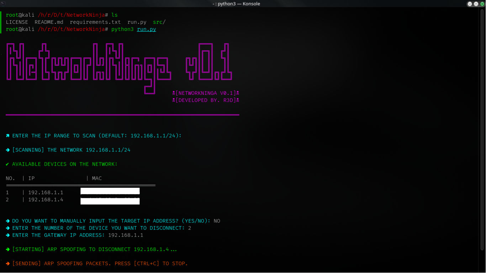

# NetworkNinja

**Version**: 0.1  
**Developed by**: R3D

## Overview

NetworkNinja is a Python tool to scan a local network, identify devices, and perform ARP spoofing to disconnect a specific device. 

## Features

- Scan local networks to detect connected devices.
- Display IP and MAC addresses.
- Perform ARP spoofing to disconnect a device.
## Disclaimer

This tool is intended for educational purposes only. It should be used to learn about network scanning and ARP spoofing techniques in a controlled environment where you have permission to test. Unauthorized use of this tool against networks or devices without permission may be illegal and unethical.

## Installation

1. Clone this repository:
    ```bash
    git clone https://github.com/R3D-LOLZ/NetworkNinja.git
    cd NetworkNinja
    ```

2. Install dependencies:
    ```bash
    pip install -r requirements.txt
    ```

3. Run the tool (Ensure you have root privileges, as ARP spoofing requires elevated permissions.):
    ```bash
    cd NetworkNinja/
    chmod +x run.py
    sudo python3 run.py
    ```

## License

MIT License - see the [LICENSE](LICENSE) file for details.


## Connect with me

[](https://t.me/r3d_v1)
[](https://github.com/R3D-LOLZ)
[](https://www.youtube.com/c/R3D_0)

