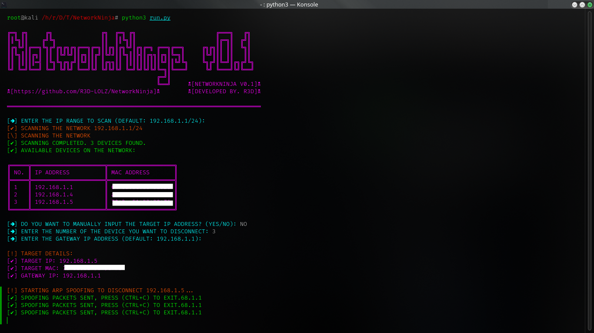

# NetworkNinja

**Version**: 0.1  
**Developed by**: R3D

## Overview

NetworkNinja is an advanced Python-based tool designed for network security professionals and penetration testers. The tool enables comprehensive scanning of local networks to identify connected devices and selectively execute ARP spoofing attacks to disrupt network connectivity for specific targets. With a focus on simplicity and effectiveness, NetworkNinja is ideal for both educational purposes and practical applications in network security testing.


## Features

- Network Scanning: Efficiently scans the local network (IPv4 range) to identify all connected devices, displaying their IP and MAC addresses for easy selection.
- ARP Spoofing: Implements ARP spoofing techniques to intercept network traffic and disconnect selected devices from the network, allowing for targeted denial-of-service attacks.
- Automated ARP Table Restoration: Ensures that ARP tables are automatically restored to their original state after the spoofing attack is terminated, preventing network disruptions.
- User-Friendly Interface: Offers an interactive, command-line interface for easy operation, with clear prompts and feedback throughout the process.
  
## Legal Disclaimer

NetworkNinja is intended solely for educational purposes and lawful security testing. Unauthorized use of this tool on networks you do not own or have explicit permission to test is illegal and unethical. The developers assume no liability for misuse of this tool.

## Installation

1. Clone this repository:
    ```bash
    git clone https://github.com/R3D-LOLZ/NetworkNinja.git
    cd NetworkNinja
    ```

2. Install dependencies:
    ```bash
    pip install -r requirements.txt
    ```

3. Run the tool (Ensure you have root privileges, as ARP spoofing requires elevated permissions.):
    ```bash
    cd NetworkNinja/
    chmod +x run.py
    sudo python3 run.py
    ```
## Usage

- Scan the Network: Input the desired IP range to scan. The default is 192.168.1.1/24.
- Select Target: Choose a device from the list of detected devices to initiate ARP spoofing.
- Perform ARP Spoofing: Monitor the status as ARP spoofing packets are sent to disconnect the target device.
- Terminate and Restore: Press [CTRL+C] to stop the attack and automatically restore the ARP table for the target device, ensuring network stability.

## License

MIT License - see the [LICENSE](LICENSE) file for details.


## Connect with me

[](https://t.me/r3d_v1)
[](https://github.com/R3D-LOLZ)
[](https://www.youtube.com/@r3d_0)


